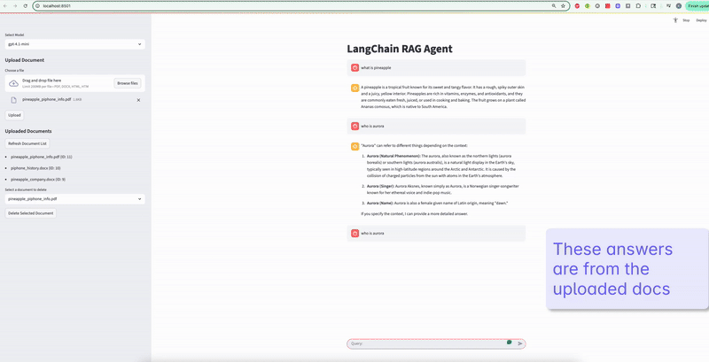

# LangChain RAG Application with FastAPI and Streamlit

A production-ready Question-Answering system built using **Retrieval-Augmented Generation (RAG)**, combining **Large Language Models (LLMs)** with **semantic search** for intelligent document analysis.

---

## 🚀 Key Features

- 🔍 **Retrieval-Augmented Generation**: Combines document retrieval with LLM response generation for context-aware answers.
- 📄 **Multi-Format Document Support**: Upload and process PDF, DOCX, and HTML files.
- 💬 **Session-Based Chat Memory**: Maintains conversation history across interactions.
- 🧠 **Chroma Vector DB Integration**: Efficient semantic search powered by ChromaDB.
- ⚡ **FastAPI Backend**: RESTful APIs with automatic documentation.
- 🖥️ **Streamlit Frontend**: Simple and responsive chatbot UI.
- 🗃️ **Persistent Storage**: Uses SQLite to store metadata and chat history.

---

## 🎥 Demo



**[▶️ Watch Full Demo Video](./demo/langchain-rag-app-demo.mp4)**

The demo showcases:
- Document upload (PDF/DOCX/HTML)
- Real-time question answering with context retrieval
- Session-based conversation memory
- Document management (list/delete)

---

## 🏗️ Architecture Overview

```
[ User ] 
   ↓
Streamlit Chat UI 
   ↓
FastAPI Backend (LangChain LCEL Chains)
   ↓
ChromaDB (Vector Store) + SQLite (Metadata)
   ↓
OpenAI (LLM Inference)
```

---

## 🧰 Tech Stack

- **LangChain LCEL** – Composable chain building for LLM orchestration
- **OpenAI** – Large Language Models for response generation
- **FastAPI** – Modern async Python web framework
- **Streamlit** – UI for interactive chat experience
- **ChromaDB** – Open-source vector database
- **SQLite** – Lightweight database for persistence
- **Python 3.12+**

---

## 📦 Prerequisites

- Python 3.12 or higher
- OpenAI API key
- Minimum 4GB RAM (8GB recommended)

---

## ⚙️ Installation

1. **Clone the Repository**
   ```bash
   git clone <repository-url>
   cd langchain-rag-app
   ```

2. **Create and Activate Virtual Environment**
   ```bash
   python -m venv .venv
   source .venv/bin/activate  # On Windows: .venv\Scripts\activate
   ```

3. **Install Dependencies**
   ```bash
   pip install -r requirements.txt
   ```

4. **Add Environment Variables**
   Create a `.env` file in the `be-app-fastAPI/` directory:
   ```env
   OPENAI_API_KEY=your_openai_api_key_here
   ```

---

## 🚀 Quick Start

### Start Backend (FastAPI)
```bash
cd be-app-fastAPI
uvicorn main:app --reload --port 8000
```
Visit API docs at: [http://localhost:8000/docs](http://localhost:8000/docs)

### Start Frontend (Streamlit)
In a new terminal:
```bash
cd ui-app
streamlit run app.py
```
Access UI at: [http://localhost:8501](http://localhost:8501)

---

## 🔌 API Endpoints

| Endpoint       | Method | Description                                        |
|----------------|--------|----------------------------------------------------|
| `/chat`        | POST   | Query documents using RAG pipeline                |
| `/upload-doc`  | POST   | Upload and index documents                        |
| `/list-docs`   | GET    | List all uploaded documents with metadata         |
| `/delete-doc`  | POST   | Delete a document from vector DB and metadata DB  |

### 📘 Example API Request

```json
POST /chat
{
  "question": "What is machine learning?",
  "session_id": "abc123",
  "model": "gpt-4o-mini"
}
```

---

## 📁 Project Structure

```
langchain-rag-app/
├── be-app-fastAPI/              # Backend - FastAPI app
│   ├── main.py                  # Entry point
│   ├── langchain_utils.py       # LangChain chain config
│   ├── chroma_utils.py          # ChromaDB operations
│   ├── db_utils.py              # SQLite helpers
│   ├── pydantic_models.py       # Request/response schemas
│   └── chroma_db/               # Vector DB storage
├── ui-app/                      # Frontend - Streamlit UI
│   ├── app.py                   # Main UI script
│   ├── chat_interface.py        # Chat logic
│   ├── sidebar.py               # Upload/list interface
│   └── api_utils.py             # FastAPI communication
├── requirements.txt             # Python dependencies
└── README.md                    # You're here!
```

---

## 🧠 How RAG Works

1. 📄 **Document Upload**: User uploads PDF, DOCX, or HTML files
2. 🧬 **Vectorization**: Content is chunked and embedded using OpenAI
3. 🔎 **Semantic Search**: ChromaDB retrieves top relevant chunks
4. 🧠 **LLM Response**: OpenAI GPT generates answers using context
5. 🧾 **Session Memory**: SQLite stores Q&A history per session

---

## 💼 Use Cases

- 💡 Internal knowledge base for enterprises
- 🤖 Customer support assistants
- ⚖️ Legal or contract analysis tools
- 📚 Academic paper search and summarization
- 🧰 Interactive product documentation tools

---

Built using modern NLP, LLMs, and vector search techniques.  
Ideal for developers exploring **LangChain**, **RAG**, and **full-stack AI apps**.

---

## 🔗 Related Tags

`LangChain`, `RAG`, `LLM`, `FastAPI`, `Streamlit`, `ChromaDB`, `OpenAI`, `Python AI Project`, `AI Chatbot`, `Document Search`, `Semantic Search`, `Vector Store`, `GPT-4`
